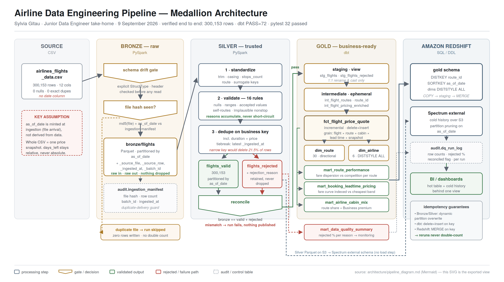

# Airline Data Engineering Pipeline

**Junior Data Engineer — Take-Home Technical Assignment**
Sylvia Gitau · 9 September 2026

An end-to-end Medallion pipeline that turns the supplied airline flight
pricing CSV into analytics-ready datasets: **PySpark** for Bronze and Silver,
**dbt** for modelling, a **Gold** layer of business marts, and **Amazon
Redshift** DDL for the warehouse target.

Verified by actually running the pipeline, not just written:

| Stage | Result |
|---|---|
| Bronze | 300,153 rows ingested, schema check passed, reconciled |
| Silver | 300,153 valid / 0 rejected (source file is genuinely clean) |
| dbt | `dbt build` → 72/72 tests pass, 0 errors |
| pytest | 32/32 passed |
| Incremental | Second snapshot loaded; day-one partition untouched on rerun |
| Reject path | Proven on an injected-fault file: 9 rejects, 8 distinct reasons |

---

## 1. Architecture



```
airlines_flights_data.csv
        │
        ▼  PySpark — explicit schema, drift gate, file-hash manifest
   BRONZE  raw, immutable, partitioned by as_of_date
        │
        ▼  PySpark — standardize → validate → dedupe → split
   SILVER  flights_valid/  +  flights_rejected/ (with reason)
        │
        ▼  dbt — staging (view) → intermediate (ephemeral) → marts
     GOLD  fct_flight_price_quote · dim_route · dim_airline
           + 3 business marts + 1 data-quality mart
        │
        ▼  COPY + MERGE, or Spectrum external schema
 REDSHIFT  gold schema — DISTKEY route_id, SORTKEY as_of_date
```

Full flowchart, daily-run sequence diagram, and per-layer contracts:
[`architecture/pipeline_diagram.md`](architecture/pipeline_diagram.md).

---

## 2. Setup and run

**Requirements:** Python 3.9+, Java 17 or 21 (PySpark needs a JVM). No cloud
account or network access needed at build time.

```bash
pip install -r documentation/requirements.txt
```

dbt runs on **DuckDB** against the Silver Parquet — close enough to Redshift
SQL that the models and tests genuinely execute, and it builds offline.

```bash
# 1. Place the supplied CSV (not committed)
mkdir -p data/raw && cp /path/to/airlines_flights_data.csv data/raw/

# 2. Bronze + Silver
python pyspark/run_pipeline.py

# 3. dbt: build models and run all tests
mkdir -p data/warehouse
cd dbt/kenya_airways
DBT_PROFILES_DIR=. dbt build
DBT_PROFILES_DIR=. dbt docs generate
cd ../..

# 4. Unit tests
pytest tests -v
```

**Incremental + reject path demo:**
```bash
python tests/make_dq_demo_file.py                       # 9 broken rows, on purpose
python pyspark/run_pipeline.py --source-file data/raw/samples/flights_dq_demo.csv --as-of-date 2026-09-10
python pyspark/run_pipeline.py --as-of-date 2026-09-09 --force   # rerun day one — no double count
```

Outputs land in `data/lake/` (gitignored, regenerated by the commands above).
Every run prints a DQ block with row counts and a `reconciled` flag.

---

## 3. Assumptions

Full list with reasoning: [`documentation/assumptions.md`](documentation/assumptions.md).
Two shape everything else:

- **`as_of_date` is minted at ingestion.** The source has 12 columns and no
  date; `days_left` is a *relative* lead time. Every downstream need
  (partitioning, incremental loads, dedup, reconciliation) needs a logical
  date, so Bronze mints one from `--as-of-date` → env var → file mtime →
  today, and treats the whole CSV as one price snapshot.

- **The business key includes `duration` and `price`.** The obvious key
  (flight + route + time buckets + class + days_left + as_of_date) collapses
  300,153 rows to 235,761 — a silent 21.5% loss. Checking why: those 45,579
  groups are genuine fare/schedule variants of the same flight, not
  duplicates — zero exact duplicates exist across all 11 business attributes.
  So the key adds `duration` and `price`, deduplicating true repeat delivery
  while keeping every real fare variant. Evidence:
  [`documentation/silver_dq_findings.md`](documentation/silver_dq_findings.md).

Also: routes are directional; prices are INR, unconverted; rejected rows are
retained, never dropped; a missing/extra column fails the run, a reordered
one does not.

---

## 4. Data quality approach

Detail: [`documentation/data_quality.md`](documentation/data_quality.md).

| Control | Mechanism | On failure |
|---|---|---|
| Missing / invalid values | 16 rules declared in `config.RULES` | → `silver_rejected/` with reason; run continues |
| Duplicates | Business-key dedupe, tiebreak on latest `_ingested_at` | → rejected as `duplicate_business_key` |
| Invalid business values | `config.ACCEPTED_VALUES`, re-asserted as dbt tests | Rejected in Silver; dbt fails the build if one slips through |
| Schema drift | Checked on the header, before any read | Halts ingestion — nothing written |
| Source-to-target | `bronze == valid + rejected`, plus dbt tests | Fails the run |

Two choices worth noting: rejection reasons **accumulate** (a row breaking
three rules reports all three), and standardization runs **before**
validation (so `" economy "` gets cleaned, not rejected).

The supplied file is genuinely clean, so the reject path is proven separately
with `tests/make_dq_demo_file.py`, which injects one bad row per failure
mode. Nothing is ever silently dropped — a clean day still writes an empty,
correctly-typed rejected partition.

---

## 5. Incremental strategy

Detail: [`documentation/incremental_strategy.md`](documentation/incremental_strategy.md).

`as_of_date` partitions every layer, and it's inside the business key — so a
new date **appends** (price history), while a rerun on the same date
**replaces itself**.

| Scenario | Handling |
|---|---|
| New records | New `as_of_date` partition; dbt filters `as_of_date >= max(as_of_date)` |
| Changed records | New snapshot appends a row (that *is* the price history) |
| Duplicate file | Bronze checks `md5(file)` against the manifest — a re-send is a no-op |
| Reruns | Dynamic partition overwrite (Bronze/Silver) + `delete+insert` (dbt) + `MERGE` (Redshift). Verified: day-one stayed at exactly 300,153 rows after the day-two run |
| Late data | Logical `as_of_date` is separate from physical `_ingested_at`, so a late file lands in and corrects only its own partition |

Caveat: the incremental filter uses `max(as_of_date)`, so a *very* old late
file needs `--full-refresh`. Production would use a `_batch_id` watermark
table instead — a deliberate simplification for a 24-hour exercise.

---

## 6. Data model

Detail and ER diagram: [`documentation/data_model.md`](documentation/data_model.md).

**Grain:** one row = one price quote, for one flight number, on one
directional route, in one cabin class, at one booking lead time, captured in
one price snapshot (`as_of_date`). `quote_count` counts quotes, not flights —
one flight can have several fare variants.

**Star schema:** `fct_flight_price_quote` (incremental) → `dim_route` (30,
directional), `dim_airline` (6), `dim_lead_time_bucket` (5). No `dim_date`:
with one snapshot date per file, it would just be a table of dates joined to
itself.

**The three business marts:**

| Mart | Grain | Business value |
|---|---|---|
| `mart_route_performance` | route × cabin × snapshot | Where a carrier holds a price premium vs. where competition has compressed fares |
| `mart_booking_leadtime_pricing` | route × cabin × lead-time band × snapshot | The fare curve as departure approaches — drives advance-purchase fencing and campaign timing |
| `mart_airline_cabin_mix` | airline × route × snapshot | Competitive share *per route* (carrier volume is heavily skewed) plus the Business-over-Economy premium |

Plus `mart_data_quality_summary` for the monitoring dashboard. Shared logic
(`lead_time_bucket`, `price_per_hour_inr`, `is_premium_cabin`) is defined once
in `int_flight_pricing_enriched` so the marts can't disagree.

---

## 7. Redshift

DDL: `redshift/ddl/`. Rationale: [`documentation/redshift_design.md`](documentation/redshift_design.md).

- **Fact:** `DISTKEY(route_id)` — every mart aggregates by route, and 30
  values over 300k rows distributes evenly. `DISTKEY(as_of_date)` would be
  the worst choice: one snapshot per day means every load lands on one slice.
- **Sort:** `COMPOUND SORTKEY(as_of_date, route_id, cabin_class)` — date-led,
  for zone-map pruning on date filters and cheap `VACUUM`.
- **Dimensions:** `DISTSTYLE ALL` — small enough that joins never redistribute.
- **Keys:** deterministic md5 surrogates, not `IDENTITY`, so they survive
  reruns and full refreshes.
- **Scaling:** route cardinality is fixed at 30 while the fact grows without
  limit, so `skew_rows` is on the monitoring list, not checked once and
  forgotten. Hot-table + Spectrum-for-cold-history is the path past ~100M rows.

---

## 8. Monitoring

Detail: [`documentation/monitoring.md`](documentation/monitoring.md). Reads
from artefacts the pipeline already writes — no log scraping needed.

- **Paging:** reconciliation failure · schema drift · no file by SLA+2h · any
  dbt test failure on the fact or a mart.
- **Alerting:** `rejected_pct > 2%` · row count ±20% from the 7-day median ·
  a rejection reason never seen before · avg fare per cabin moving >30% day
  over day.
- **Ticketing:** runtime >2× average · `skew_rows > 2` or `unsorted > 20%` ·
  duplicate file delivered.

Includes business-plausibility checks, because a run can reconcile perfectly
and still be wrong — a truncated file reconciles against itself just fine.

---

## 9. Repository layout

```
├── README.md
├── architecture/pipeline_diagram.md   Mermaid: flowchart, sequence, contracts
├── pyspark/
│   ├── common/                        config, schemas + drift check, audit log
│   ├── bronze/bronze_ingest.py
│   ├── silver/silver_transform.py
│   └── run_pipeline.py
├── dbt/kenya_airways/
│   ├── models/staging/                stg_flights, stg_flights_rejected
│   ├── models/intermediate/           shared enrichment logic
│   ├── models/marts/                  fct, 2 dims, 4 marts
│   ├── macros/ + tests/
├── redshift/ddl/                      01_schemas → 05_external_spectrum
├── tests/                             pytest: Silver rules, schema drift, DQ demo file
└── documentation/                     assumptions, DQ findings, data model,
                                        incremental strategy, redshift design,
                                        monitoring, requirements.txt
```

`data/` is not committed — place the supplied CSV at `data/raw/`; the
generated lake (`data/lake/`, `data/warehouse/`) is rebuilt by the commands
in section 2.

---

## 10. Limitations

1. **`as_of_date` is invented** — the most consequential assumption here. If
   the real ingestion date differs from the file's mtime, partition labels
   shift. `--as-of-date` exists so the value is explicit and overridable.
2. **No departure date**, so no true time series — `days_left` gives only a
   relative pricing curve.
3. **One snapshot in the supplied data** — the incremental path is proven
   with a synthetic second snapshot, not observed over real daily files.
4. **DuckDB is not Redshift** — the SQL runs and passes, but `DISTKEY`/`SORTKEY`
   behaviour and `MERGE` performance are unverified against a real cluster.
5. **Marts rebuild fully** — fine at this size, but should go incremental
   before the fact passes ~10M rows.
6. **No currency dimension** — fares are INR, unconverted.
7. **Fare outliers are surfaced, not rejected** — the marts expose spread and
   stddev so an analyst judges, rather than a filter silently deleting real
   premium fares.
8. **No PII, so no masking layer** — would be required before Gold if
   passenger data were ever joined in.

---

## 11. Contact

Sylvia Gitau
Submitted for the Junior Data Engineer take-home assignment.