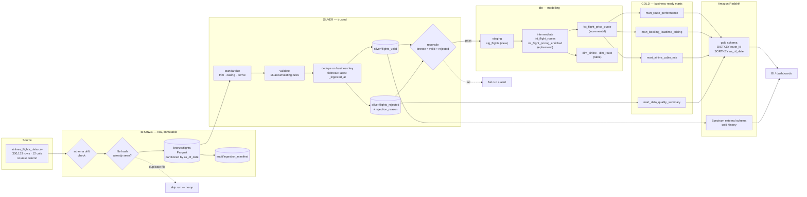
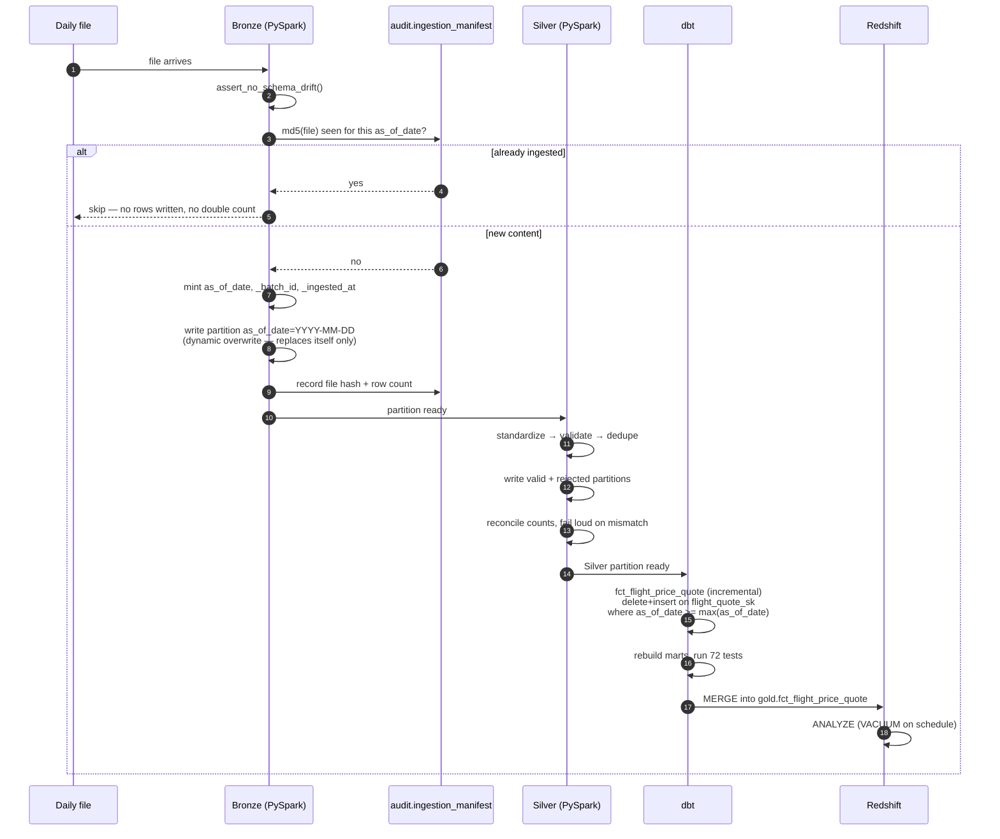

# Pipeline Architecture

Mermaid renders natively on GitHub and diffs as text, so the diagram reviews
like code instead of like a binary attachment. `pipeline_diagram.svg` and
`pipeline_diagram.png` are exported views of the same design, committed so the
diagram is readable without a Mermaid renderer (in a plain editor, a Word
document, or a printout).

## End-to-end flow

## Daily incremental run

What actually happens when tomorrow's file lands — and why a rerun is safe.

## Layer contracts

| Layer | Writes what | Never does |
|---|---|---|
| **Bronze** | Every source row, plus metadata we control | Filter, cast beyond the declared schema, or apply business logic |
| **Silver** | Two datasets — valid and rejected, both partitioned, both reconciled | Drop a row without recording why |
| **dbt staging** | 1:1 renames and casts | Join, filter, aggregate |
| **dbt intermediate** | Derived measures, defined once | Persist anything nobody queries |
| **Gold marts** | Aggregates with a stated grain and business purpose | Re-derive a measure that intermediate already defines |
| **Redshift** | Sorted, distributed, granted | Enforce keys (that is dbt's job) |
