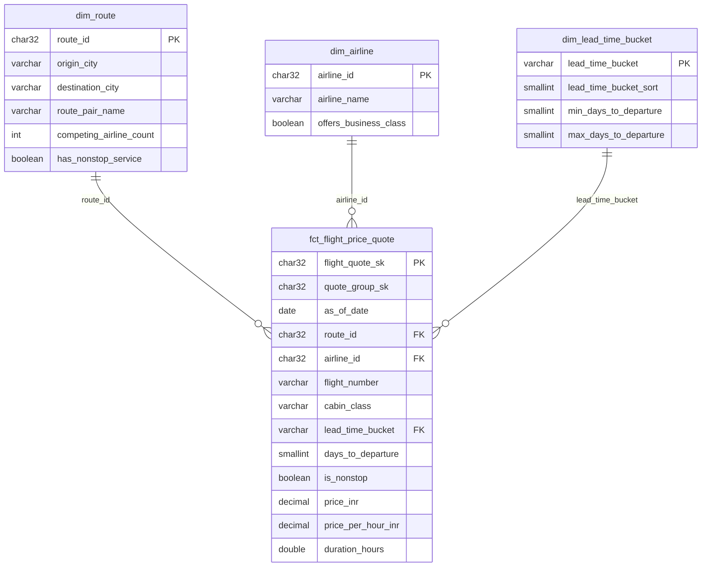

# Data Model

## Grain of the fact table

Stated identically here, in the `fct_flight_price_quote` model comment, in the
dbt `description:`, and in the Redshift `COMMENT ON TABLE`:

> **One row = one price quote for one flight number, on one directional route,
> in one cabin class, at one booking lead time (`days_to_departure`), captured
> in one price snapshot (`as_of_date`).**

Natural key:

```
flight_number + origin_city + destination_city + departure_time_bucket
              + arrival_time_bucket + cabin_class + days_to_departure
              + duration + price + as_of_date
```

surrogated as `flight_quote_sk` = `md5(...)`, computed in Silver so it is stable
across reruns and full refreshes.

**Why `duration` and `price` are part of the grain.** The source lists several
genuine fare variants for the same flight in the same time bucket. Excluding
them would make the key collapse 300,153 rows into 235,761 and silently delete
21.5% of the data. Full evidence in `documentation/silver_dq_findings.md`
Finding 1.

**What one row is not.** It is not one flight, and not one seat. `quote_count`
in the marts counts *quotes*. Reading it as capacity would overstate the network.

---

## Star schema



A conformed date dimension is deliberately absent. With one snapshot date per
file and no departure date in the source, `as_of_date` on the fact is the whole
of the time grain — a `dim_date` would be a table of dates joined to itself.
The moment a departure date exists, it goes in.

**Degenerate dimensions kept on the fact.** `flight_number`,
`departure_time_bucket`, `arrival_time_bucket`, `stops_label` and
`airline_name` are stored on the fact as well as (or instead of) in a dimension.
With 1,561 flight numbers and 6 time buckets, a `dim_flight` would be a join
that buys nothing; keeping the label on the fact means the most common queries
touch one table. `airline_name` is duplicated from `dim_airline` for the same
reason, at a cost of a few bytes per row.

---

## Model lineage

```
silver.flights_valid (Parquet, external)
    └── stg_flights                      view       1:1 rename/cast
            ├── int_flight_routes             ephemeral  route_id
            └── int_flight_pricing_enriched   ephemeral  derived measures
                    ├── dim_airline               table
                    ├── dim_route                 table
                    └── fct_flight_price_quote    incremental
                            ├── mart_route_performance
                            ├── mart_booking_leadtime_pricing
                            └── mart_airline_cabin_mix

silver.flights_rejected (Parquet, external)
    └── stg_flights_rejected             view
            └── mart_data_quality_summary    table
```

### Materialization choices

| Layer | Materialization | Reason |
|---|---|---|
| staging | `view` | Thin renames; no storage cost, never stale |
| intermediate | `ephemeral` | Inlined as CTEs — nothing persisted that nobody queries |
| dimensions | `table` | Tiny, read constantly, `DISTSTYLE ALL` in Redshift |
| fact | `incremental` | Grows one snapshot per day; `delete+insert` on the key |
| marts | `table` | Read many times by BI; full rebuild is cheap at this size |

**Where derived logic lives.** `lead_time_bucket`, `price_per_hour_inr` and
`is_premium_cabin` are defined once, in `int_flight_pricing_enriched`, using
macros whose thresholds come from `dbt_project.yml` vars. Three marts consume
them, so they cannot disagree about what a "medium lead time" is. Changing the
banding is a one-line change in one file.

---

## Gold marts

### 1. `mart_route_performance`

**Grain:** route × cabin class × snapshot.

**Business question:** which routes are expensive, which are competitive, and
where does fare dispersion suggest pricing opportunity?

**Measures:** `quote_count`, `airline_count`, `flight_number_count`,
`avg/min/max_price_inr`, `price_spread_inr`, `price_stddev_inr`,
`max_to_min_price_ratio`, `avg_duration_hours`, `fastest_duration_hours`,
`avg_price_per_hour_inr`, `nonstop_share_pct`.

**Business value.** Network and pricing teams use it to find routes where one
carrier holds a premium (few competitors, high average fare) and routes where
competition has compressed fares. The spread and standard deviation matter more
than the average: a wide spread on a busy route is where revenue management has
room to move. `avg_price_per_hour_inr` makes a 2-hour nonstop and a 12-hour
two-stop comparable, which a raw fare comparison cannot do.

### 2. `mart_booking_leadtime_pricing`

**Grain:** route × cabin class × lead-time bucket × snapshot.

**Business question:** how does fare move as departure approaches, and how does
that curve differ by route and cabin?

**Measures:** `quote_count`, `avg/min/max_price_inr`,
`avg_price_per_hour_inr`, `cheapest_band_avg_price_inr`,
`price_index_vs_cheapest_band` (100 = the cheapest band on that route and
cabin), `pct_uplift_vs_advance_band`.

**Business value.** The mart that answers "when should we push fares up?" Each
band is indexed against the cheapest band on the same route and cabin, so the
shape of the curve is visible without the analyst constructing a baseline first.
Commercial uses it for advance-purchase fencing; marketing uses it to time
campaigns into the bands where price sensitivity is highest.

### 3. `mart_airline_cabin_mix`

**Grain:** airline × route × snapshot. Cabins are columns, not rows, because the
premium is a ratio *between* cabins and belongs on one row.

**Business question:** who competes where, and what does the Business-over-
Economy premium look like by carrier and route?

**Measures:** `quote_count`, `economy_quote_count`, `business_quote_count`,
`avg_economy_price_inr`, `avg_business_price_inr`, `route_share_pct`,
`business_premium_pct`, `nonstop_share_pct`, `sells_business_cabin`.

**Business value.** Two things at once. `route_share_pct` gives the competitive
picture per route — computed per route, not network-wide, because carrier volume
in this dataset is heavily skewed (Vistara 127,859 rows vs SpiceJet 9,011) and a
network-wide share would just re-report that skew. `business_premium_pct`
quantifies the upsell: high share with a thin premium means money left on the
table; thin share with a fat premium means a niche premium product.

`business_premium_pct` is **NULL**, never 0, where a carrier sells only one
cabin on a route — a zero would imply a cabin parity that does not exist.
Baseline for sanity checks: Business averages ~8× Economy across the dataset
(₹52,540 vs ₹6,572).

### 4. `mart_data_quality_summary` (supporting)

**Grain:** snapshot × rejection reason.

Not a business mart — this is what the monitoring dashboard points at. It
carries `accepted_row_count`, `rejected_row_count_total`,
`bronze_row_count_reconciled` and `rejected_pct`, so the >2% alert in
`documentation/monitoring.md` reads from a table rather than from log scraping.

---

## Naming conventions

| Pattern | Meaning |
|---|---|
| `_source_*`, `_ingested_at`, `_batch_id`, `_file_hash` | Metadata we minted, never from the source (leading underscore) |
| `*_sk` | Surrogate key (deterministic md5, not IDENTITY) |
| `*_id` | Dimension key |
| `*_inr` | Money, in Indian Rupees — unit in the name so it cannot be mistaken |
| `is_*`, `has_*`, `sells_*` | Boolean |
| `*_pct` | Percentage on a 0–100 scale, not a 0–1 fraction |
| `*_count` | Integer count; `quote_count` counts quotes, not flights |
| `stg_`, `int_`, `dim_`, `fct_`, `mart_` | Layer, so a model's role is readable from its name alone |
